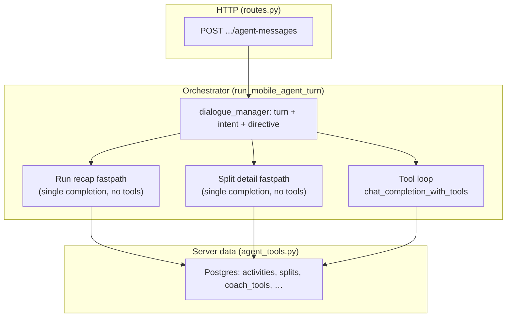

# SmartCoach mobile Coach (chat) — architecture

**Canonical spec** for the production **Coach tab** backend: `src/smartcoach_mobile_coach/`.
**Not** the experimental `coach/` package (`tests/coach/`, `docs/coach-architecture/` v2 program) — see [../coach-architecture/README.md](../coach-architecture/README.md).

**Shorter ops + entry point:** [../SMARTCOACH_MOBILE_COACH.md](../SMARTCOACH_MOBILE_COACH.md)

---

## Documentation strategy

| Layer | Role | When to update |
|-------|------|----------------|
| **This file** | Human-readable architecture: flows, contracts, env, boundaries vs other systems. | Any change to agent **HTTP contract**, **fastpaths**, **tool loop behavior**, or **cross-service** assumptions. |
| [`SMARTCOACH_MOBILE_COACH.md`](../SMARTCOACH_MOBILE_COACH.md) | Quick entry: route, env, eval, deploy notes. | Same triggers; keep it short and link here for depth. |
| **`scripts/setup_coach_tools.py`** | Tool names, descriptions, schemas for DB + OpenAI tool loop. | Adding/renaming tools or changing tool descriptions. |
| **Module docstrings** (`orchestrator.py`, `run_recap_fastpath.py`, `dialogue_manager.py`, `routes.py`) | Implementation detail next to code. | Always update when behavior changes (even if this README is updated in the same PR). |

**PR rule:** If you touch `run_mobile_agent_turn`, fastpath helpers, `agent_messages` request/response shape, or tool injection in `orchestrator.py` / `routes.py` / `run_recap_fastpath.py` / `run_recap_comparison_bundle.py` / `run_recap_week_volume_bundle.py`, update **this README** (and [`SMARTCOACH_MOBILE_COACH.md`](../SMARTCOACH_MOBILE_COACH.md) if env or HTTP contract changed).

---

## How the architecture breaks out

1. **HTTP** — Auth, rate limit, load/save `ConversationMessage`, build **plain-text** history for the LLM vs **raw** JSON for thread-derived `activity_id` (`thread_derived_context.py`).
2. **Orchestration** — System prompt assembly, then one of:
   - **Run recap fastpath** — Opening anchor-day recap; prefetches `find_runs_by_date` + `get_run_summary` (execution KPIs for the **card**); **LLM appendix** uses compact **facts-only** JSON by default (`SMARTCOACH_RUN_RECAP_PREFETCH_SLIM`); optionally prefetches **1–2 prior calendar days** that each had a **single** run (`run_recap_comparison_bundle.py`, `SMARTCOACH_RUN_RECAP_COMPARISON_*`, includes **`when_vs_anchor`** for human phrasing) and **this ISO week vs last ISO week** run count + miles (`run_recap_week_volume_bundle.py`, `SMARTCOACH_RUN_RECAP_WEEK_VOLUME_BUNDLE`, **`spoken_timeframe`** “this week” / “last week”) via `aggregate_runs_in_range` / `weekly_summaries`—**no KPI/drift** in those JSON slices; one `chat_completion` without tools; returns structured `run_summary` when valid. Messages that ask for **drift** in the same turn skip fastpath so the tool loop can answer.
   - **Split detail fastpath** — Intent `split_detail`; prefetches `get_run_splits` after resolving `activity_id` (hint, thread, or single run on anchor date); one `chat_completion` without tools; plain text response + metadata `split_detail_fastpath`.
   - **Tool loop** — Default: bounded `chat_completion_with_tools` + `execute_tool`.
3. **Tools** — Definitions from **`coach_tools`** (seeded by `scripts/setup_coach_tools.py`); critical tools may be **injected** from `orchestrator.py` if missing from DB. **`get_weekly_training_insight`** defaults to an **orientation** payload for the model (`week_start`, `week_end`, `overall_band`) unless the tool call sets **`include_kpi_detail`: true** (`SMARTCOACH_WEEKLY_INSIGHT_TOOL_SLIM`); REST weekly insight stays full.
4. **Dialogue** — `dialogue_manager.py` classifies turn, infers intent, sets tool strategy / length (prompt sections only; no extra network).

---

## Request body (`agent-messages`)

| Field | Required | Notes |
|-------|----------|--------|
| `message` | Yes | User text. |
| `client_local_date` / `clientLocalDate` | Strongly recommended | Device **calendar** date `YYYY-MM-DD` for “today” and anchor tools. |
| `client_timezone` / `clientTimezone` | Optional | IANA name for system prompt only. |
| `last_activity_id` / `lastActivityId` | Optional | Positive int; **split fastpath** hint after a structured `run_summary` turn. Server also derives id from stored `run_summary` JSON when omitted. |

---

## Response shapes

- **Assistant persistence:** `ConversationMessage.content` may be **plain string** or **JSON string** of `{ "type": "run_summary", "content": "…", "data": { … } }` for card payloads.
- **HTTP JSON:** `response` mirrors that (string or structured object); `token_usage`, `message_id`, etc. per `routes.py`.

---

## Key modules

| Module | Responsibility |
|--------|------------------|
| `routes.py` | Blueprint, auth, rate limit, history shaping, `last_activity_id` hint, persistence. |
| `orchestrator.py` | Tool list load/inject, system prompt, fastpaths, agent loop, metadata. |
| `run_recap_fastpath.py` | Recap + split-detail prefetch and “no tools” system appendices. |
| `run_recap_comparison_bundle.py` | Optional **prior single-run day** facts (KPI-free) for recap LLM appendix. |
| `run_recap_week_volume_bundle.py` | Optional **this ISO week vs last ISO week** volume (run count + miles, KPI-free) for recap appendix. |
| `run_recap_policy.py` | Anchor-day recap fastpath eligibility (phrases, blocks, first user turn) + reason codes for logs/metadata. |
| `dialogue_manager.py` | Turn type, intent, response directive (feeds system sections). |
| `thread_derived_context.py` | Parse prior structured `run_summary` from stored assistant rows. |
| `agent_tools.py` | `execute_tool` dispatch; implements `find_runs_by_date`, `get_run_summary`, `get_run_splits`, etc. |
| `run_splits.py` | Lap/split rows for `get_run_splits` (cap via `SMARTCOACH_RUN_SPLITS_MAX_ROWS`). |
| `run_insight.py` / `insight_cache.py` | Run summary payload + TTL cache for expensive insight builds. |

Legacy tool names in old docs (`list_runs_for_local_date`, `get_run_insight`) map in `agent_tools.py` to current handlers where applicable.

---

## Environment variables (mobile coach)

### Prompt experiment (A/B, default off)

Toggle in `orchestrator.py` after `SYSTEM_PROMPT_BASE`. Logs `[coach_prompt_experiment]` when any flag is on. **Staging/local only** recommended.

| Variable | When `1` / `true` / `yes` / `on` |
|----------|----------------------------------|
| `SMARTCOACH_EXPERIMENT_MINIMAL_DIRECTIVE` | Replace long `response_directive_section` with a short stub (highest leverage for less “template” voice). |
| `SMARTCOACH_EXPERIMENT_MINIMAL_PREFS` | Omit coaching-preferences rubric block. |
| `SMARTCOACH_EXPERIMENT_MINIMAL_BASE` | Replace huge `SYSTEM_PROMPT_BASE` with `MINIMAL_SYSTEM_PROMPT_BASE` (still keeps grounding: numbers from tools only). |

Device anchor, HR calibration (when needed), thread-led, and race intent override **stay on**.

| Variable | Typical | Meaning |
|----------|---------|---------|
| `SMARTCOACH_MOBILE_AGENT_ENABLED` | `true` | Master switch; off → route 503. |
| `SMARTCOACH_MOBILE_AGENT_HTTP_RPM` | `8` | Per-user HTTP rate limit for agent route. |
| `SMARTCOACH_MOBILE_INSIGHT_CACHE_TTL` | `3600` | Insight cache TTL (seconds). |
| `SMARTCOACH_AGENT_MAX_LOOPS` | `8` | Max orchestrator rounds (clamped 2–15). |
| `OPENAI_MOBILE_AGENT_TIMEOUT` | `180` | Per completion timeout (seconds). |
| `OPENAI_CONVERSATION_MODEL` | `gpt-4o` | Default model. |
| `SMARTCOACH_RUN_RECAP_FASTPATH` | `1` | Disable with `0`/`false`/`no`. |
| `SMARTCOACH_RUN_RECAP_FASTPATH_RETRY` | `1` | When on (default), if the first fastpath completion is **empty** but prefetch is valid, **one** follow-up `chat_completion` runs before falling back to the full tool loop. Set `0`/`false`/`no`/`off` to skip. |
| `SMARTCOACH_RUN_RECAP_PREFETCH_SLIM` | `1` | When on (default), recap fastpath **system appendix** JSON is **facts only** (no `training_kpis` / drift bands in the prompt); full summary still returned for the RunSummaryCard. Set `0`/`false`/`no`/`off` for legacy compact KPIs in the appendix. |
| `SMARTCOACH_RUN_RECAP_COMPARISON_BUNDLE` | `1` | When on (default), recap prefetch may add **`comparison_sessions`** for up to **N** prior **calendar days** before anchor, each with **exactly one** resolved run (skips ambiguous days); **facts-only** JSON (no KPI/drift/Z2). `0`/`false`/`no`/`off` disables the extra `find_runs_by_date` / `get_run_summary` calls. |
| `SMARTCOACH_RUN_RECAP_COMPARISON_LOOKBACK_DAYS` | `7` | How far back (in local days before anchor) to scan for single-run days; clamped `1`–`21`. |
| `SMARTCOACH_RUN_RECAP_COMPARISON_MAX` | `2` | Max prior comparison days to attach; clamped `1`–`3`. |
| `SMARTCOACH_RUN_RECAP_WEEK_VOLUME_BUNDLE` | `1` | When on (default), recap prefetch adds **`week_volume_context`** (`this_week` / `last_week`: `run_count`, `total_mi_display`, **`spoken_timeframe`**) from **`aggregate_runs_in_range`** (ISO Mon–Sun, activity local dates). `0`/`false`/`no`/`off` skips that call. |
| `SMARTCOACH_WEEKLY_INSIGHT_TOOL_SLIM` | `1` | When on (default), coach tool **`get_weekly_training_insight`** returns **orientation** only (`week_start`, `week_end`, `overall_band`) unless the model passes **`include_kpi_detail`: true**. REST `GET /api/training-insights/weekly` is always full. `0`/`false`/`no`/`off` restores legacy default (full KPI payload on every tool call). |
| `SMARTCOACH_RUN_RECAP_FASTPATH_MAX_TOKENS` | `768` | Cap completion tokens on recap fastpath. |
| `SMARTCOACH_SPLIT_DETAIL_FASTPATH` | `1` | Split-detail single-call path. |
| `SMARTCOACH_SPLIT_DETAIL_FASTPATH_MAX_TOKENS` | `1024` | Cap completion tokens on split fastpath. |
| `SMARTCOACH_RUN_SPLITS_MAX_ROWS` | `24` | Max split rows returned to model (8–64). |
| `SMARTCOACH_COACH_EVAL_MODEL_OVERRIDE` | off | Eval-only model header (see ops doc). |
| `SMARTCOACH_COACH_EVAL_REQUEST_SECRET` | unset | Shared secret for eval header. |

---

## Related systems (do not conflate)

| System | Location | Purpose |
|--------|----------|---------|
| **Mobile coach agent** | `src/smartcoach_mobile_coach/` | Production Coach tab chat. |
| **Experimental Coach v2** | `coach/`, `tests/coach/`, `docs/coach-architecture/` | Modular design / tests; not the shipped tab agent unless integrated later. |
| **Test coach HTTP** | `src/routes/coach_routes.py`, `coach/orchestrator.py` | `POST /api/coach/test` harness. |
| **SmartCoach analyze-run** | Separate service + API proxy | One-off run JSON analysis; not the conversation agent. |

---

## Eval and scripts

- `scripts/coach_feel_eval.py` — scripted “feel” eval against `agent-messages` (see [`SMARTCOACH_MOBILE_COACH.md`](../SMARTCOACH_MOBILE_COACH.md)).
